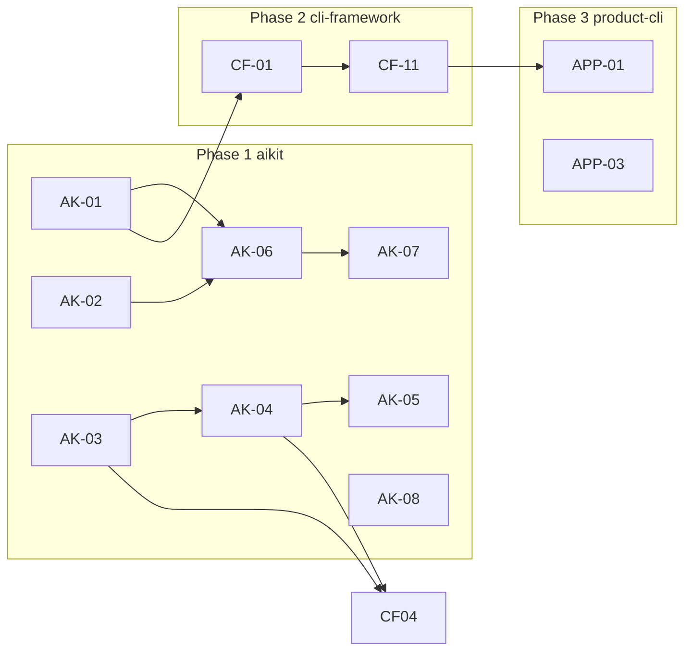

# Agent chat rollout plan

Phased delivery: **aikit (AK)** → **cli-framework (CF)** → **product-cli (APP)**.  
`cli-framework` MUST NOT implement `chat` until **aikit-sdk** exposes the embedding contract (AK-01..AK-04 minimum).

## Dependency graph

## Phase 1: goaikit/aikit

| ID | Requirement | Outcome |
|----|-------------|---------|
| AK-01 | Embedded run API (`RunOptions`, timeouts, session persona/agents) matches what `aikit run` supports for built-in `agent`. | Embedders call one stable Rust entrypoint. |
| AK-02 | Output contract (human vs NDJSON events, progress stderr rules) as **library types**, not CLI-only. | `chat` can inherit `aikit run` output behavior. |
| AK-03 | `HostToolProvider` trait (list schemas + call) in **aikit-sdk**, no cli-framework dependency. | cli-framework implements trait for commands-as-tools. |
| AK-04 | **aikit-agent** merges host tools with built-ins; persona allow/deny applies. | Single tool plane for the model. |
| AK-05 | Document interaction: yolo, host tools, built-in `RunBash`, risk expectations. | Operators know security model. |
| AK-06 | `aikit run` refactored to call same SDK entrypoints as embedders. | Parity guaranteed. |
| AK-07 | Integration tests: embedded path vs CLI for same prompt/options (event shape). | Regression guard. |
| AK-08 | Remote skills / catalog in `RunOptions` or `AgentConfig` when required for v1. | Optional if deferred. |

**Blocks:** all CF work that calls `run_aikit_agent` or host tools.

## Phase 2: aroff/cli-framework

| ID | Requirement | Outcome |
|----|-------------|---------|
| CF-01 | `chat` Cargo **feature**; pulls aikit-sdk (+ transitive aikit-agent); default build unchanged without feature. | Opt-in weight. |
| CF-02 | `chat` subcommand: CLI flags aligned with `aikit run` (`-p`, stdin, `-m`, `--yolo`, `--stream`, `--session-agents`, output/events). | User-facing parity. |
| CF-03 | Explicit **one-shot vs REPL** semantics and flags. | No ambiguous exit behavior. |
| CF-04 | Implement **HostToolProvider** using command registry + same validation path as MCP tool dispatch. | In-process same tools as MCP. |
| CF-05 | Agent-dispatched commands use **real `AppContext`**, not noop. | Correct app behavior. |
| CF-06 | **Stdio MCP server** sharing core with HTTP `mcp serve`. | Editors + `mcp install --stdio` supported. |
| CF-07 | **Gates** extension (trait or callback): CLI author controls confirmations per tool/tier. | Policy stays in product. |
| CF-08 | **`ask` deprecation**: alias/rename, messages, examples, tests. | Clear migration. |
| CF-09 | **Async**: blocking agent loop in `spawn_blocking` (or dedicated thread); timeout/cancel documented. | Stable tokio CLI. |
| CF-10 | **Security** doc: stdio MCP assumptions, local-only, risk env vars. | Safe defaults documented. |
| CF-11 | Tests + CI jobs for `chat` feature and stdio MCP smoke. | Quality bar. |

**Depends on:** AK-01, AK-02, AK-03, AK-04 (minimum). AK-05..AK-07 strongly recommended before release.

## Phase 3: aroff/product-cli

| ID | Requirement | Outcome |
|----|-------------|---------|
| APP-01 | Enable `cli-framework` **`chat`** (and any `mcp-server` / stdio flags) in `Cargo.toml`; bump **git rev** after cli-framework release. | Shipped binary includes chat. |
| APP-02 | Wire **gates** / operator policy (ailoop, env, confirmations) per product needs. | Meets org security. |
| APP-03 | End-user docs: `chat`, MCP HTTP, MCP stdio, editor snippets. | Adoption. |

**Depends on:** cli-framework release containing CF-01..CF-11 (or agreed subset for MVP).

## GitHub tracking

**Epic (index):** https://github.com/aroff/cli-framework/issues/48

| Repo | Board |
|------|--------|
| [goaikit/aikit](https://github.com/goaikit/aikit) | [AIKit project](https://github.com/orgs/goaikit/projects/1) (items added) |
| [aroff/cli-framework](https://github.com/aroff/cli-framework) | [cli-framework project](https://github.com/users/aroff/projects/13) |
| [aroff/product-cli](https://github.com/aroff/product-cli) | Same **cli-framework** project (#13) for program visibility |

### Issue URLs

| ID | URL |
|----|-----|
| AK-01 | https://github.com/goaikit/aikit/issues/20 |
| AK-02 | https://github.com/goaikit/aikit/issues/21 |
| AK-03 | https://github.com/goaikit/aikit/issues/22 |
| AK-04 | https://github.com/goaikit/aikit/issues/23 |
| AK-05 | https://github.com/goaikit/aikit/issues/24 |
| AK-06 | https://github.com/goaikit/aikit/issues/25 |
| AK-07 | https://github.com/goaikit/aikit/issues/26 |
| AK-08 | https://github.com/goaikit/aikit/issues/27 |
| CF-01 | https://github.com/aroff/cli-framework/issues/37 |
| CF-02 | https://github.com/aroff/cli-framework/issues/38 |
| CF-03 | https://github.com/aroff/cli-framework/issues/39 |
| CF-04 | https://github.com/aroff/cli-framework/issues/40 |
| CF-05 | https://github.com/aroff/cli-framework/issues/41 |
| CF-06 | https://github.com/aroff/cli-framework/issues/42 |
| CF-07 | https://github.com/aroff/cli-framework/issues/43 |
| CF-08 | https://github.com/aroff/cli-framework/issues/44 |
| CF-09 | https://github.com/aroff/cli-framework/issues/45 |
| CF-10 | https://github.com/aroff/cli-framework/issues/46 |
| CF-11 | https://github.com/aroff/cli-framework/issues/47 |
| APP-01 | https://github.com/aroff/product-cli/issues/8 |
| APP-02 | https://github.com/aroff/product-cli/issues/9 |
| APP-03 | https://github.com/aroff/product-cli/issues/10 |
